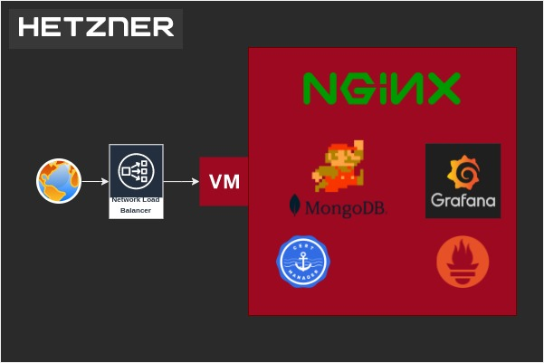

# Terraform IaC for devops-challenge infrastructure

### Requirements
- terraform >= v1.0.2
- Hetzner project
- Cloudflare configured domain

### Setup
1. Create a terraform.tfvars file like the example below:
```
hcloud-token = "<hetzner-project-token>"
ssh-pub-key  = "<path-to-ssh-public-key>"
ssh-priv-key = "<path-to-ssh-private-key>"
env          = "challange"

cf-token    = "<cloudflare-api-token>"
zone-id     = "<cloudflare-zone-id>"
domain-name = "<domain-name>"
```
2. Run:
```
./usher.sh -a
```
*In case you face an error during deploymen process, don't hesitate to go for a retry ;)*

### Destroy
Run:
```
./usher.sh -d
```

### Demo
#### App
https://devopschallenge.amirbekyan.com
#### Grafana
https://mon.devopschallenge.amirbekyan.com
```
user: admin
pass: prom-operator
```
